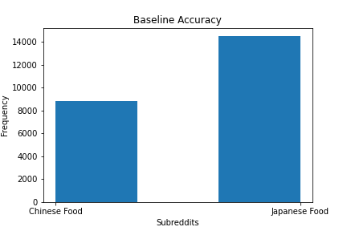
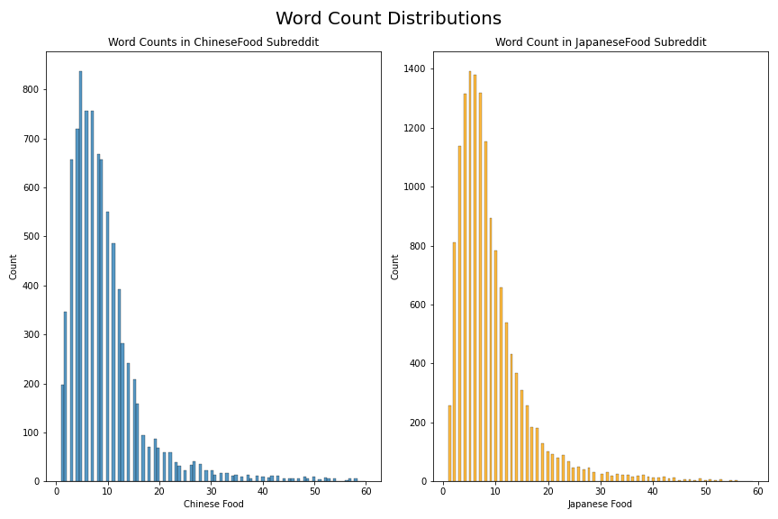
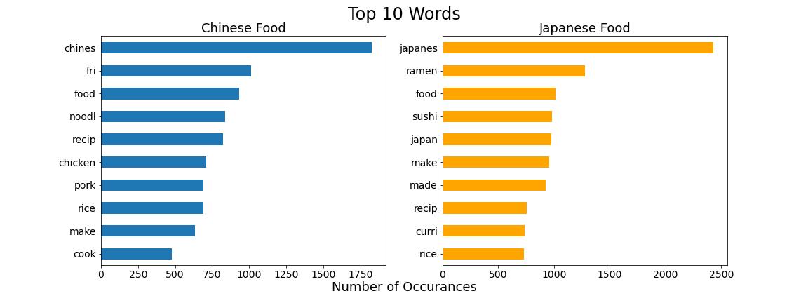
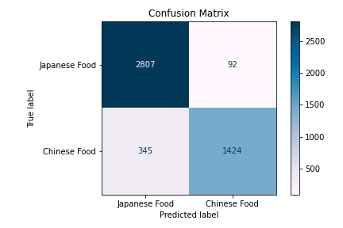

# Project 3 - Reddit Classification
---

## Problem Statement

- Japanese and Chinese cuisines share many similarities. People from non-Asian backgrounds can have difficulties telling the two cuisines apart. However, machine learning and natural language processing help us distinguish the two cuisines and classify them quickly. 
- For this project, we aim to build a classification model that can sort posts into their related subreddits according to the title of the submissions. We will evaluate the success of the models based on training and test scores. The higher the training score, the better the model fits the model, and the higher the testing score, the predictions more likely to be true.

# Datasets
---

* [`Chinesefood.csv`]('projects/project-03/Data/Chinesefood.csv'): Raw dataset of Reddit posts from Chinese Food subreddit from Saturday, March 12, 2016 5:46:06 PM (Eastern Time Zone) to Friday, December 10, 2021 6:46:53 PM (Eastern Time Zone). 

* [`Japanesefood.csv`]('projects/project-03/Data/Japanesefood.csv'): Raw dataset of Reddit posts from Japanese Food subreddit from Sunday, May 13, 2012 10:12:00 PM (Eastern Time Zone) to Friday, December 10, 2021 6:46:53 PM (Eastern Time Zone). 

* [`food.csv`]('projects/project-03/Data/food.csv'): Merged dataset with only subreddits and titles of the submissions. 

* [`cleaned_food.csv`]('projects/project-03/Data/cleaned_food.csv'): preprocessed food dataset for modeling. 

# Data Dictionary
---

|Feature|Type|Dataset|Description|
|---|---|---|---|
|**Subreddits**|*Integer*|cleaned_food| 0 : Japanese food - 1 : Chinese food |
|**Title**|*object*|cleaned_food|Title of the posts| 
|**Word Count**|*Integer*|cleaned_food|Word count in the title|
|**Tokens**|*object*|cleaned_food|Title with enlish stopwords removed, tokenized, and stemmed to root form|

# Data description and visualization
---

- Baseline accuracy: Accucary of sorting Japanese food related topics and Chinese food related topics into correct subreddits on Reddit without any modeling. 

- Distribution of word counts in the title for the posts for Japanese food subreddit and Chinese food subreddit. 

- Top 10 most occuring words in the Japanese food subreddit and the Chinese food subreddit. 

# Preprocessing
---

- Raw data collected using Pushshift API on Subreddit titles needs cleaning and preprocessing.
    1) Duplicated titles were dropped from the dataset. 
    2) English stopwords were removed from the dataset. 
    3) Titles were tokenized to remove special characters. 
    4) Tokenized titles were transformed to it's root form using lemmatizer and stemmer. 
    5) Save and export preprocessed datasets to a new csv file called clean_food. 

# Train and Test scores of different models
---

|Model|Transformer| Train score|Test score| Score difference|
|---|---|---| --- | --- |
|**Logistic Regression**|Count Vectorizer| 0.9730019284336833 | 0.9089545844044559| 0.0640473440292274 |
|**Logistic Regression**|Tfidf Vectorizer| 0.9622884079708592 | 0.910025706940874| 0.052262701029985204 |
|**Multinomial Naive Bayes**|Count Vectorizer| 0.9358795800299978 | 0.9068123393316195| 0.029067240698378294 |
|**Logistic Regression**|Tfidf Vectorizer| 0.9300407113777587 | 0.895458440445587| 0.0345822709321717 |
|**Bernoulli Naive Bayes**|Count Vectorizer| 0.9343796871652025 | 0.9063838903170522| 0.027995796848150234 |
|**Bernoulli Naive Bayes**|Tfidf Vectorizer| 0.9343796871652025 | 0.9063838903170522| 0.027995796848150234 |
|**Random Forest Classifier**|Count Vectorizer| 0.9981787015213199 | 0.8883890317052271| 0.10978966981609284 |

# Model selection
-----------------
- Multinomial and Bernoulli naive bayes perform very similarly on the testing scores. However, the Bernoulli naive baye has a slightly lower difference between training and testing scores, suggesting more balanced bias/variances trade-ff and less overfit.
- No significant differences between the choice of count vectorizers were examined.
- Random forest classifier is not a good model for this project for a couple of reasons.
    - The model is highly overfitting and has lower testing scores than all the other models.
    - Random forest classifiers do not work well with unbalanced datasets, which in our case, the number of posts in 'JapaneseFood' and 'ChineseFood' is not balanced. The unbalance will bias the result of the trees toward the majority class, which is the 'JapaneseFood' subreddit.
    
# Predictions
-------

- Confusion Matrix - Bernoulli Naive Bayes with CountVectorizor model performance on unseen data. 

     

|Confusion Matrix|Scores|
|---|---|
|**Accuracy**|0.9063838903170522|
|**Precision**| 0.9393139841688655|
|**Sensitivity**|0.8049745618993782|
|**Specificity**|0.9682649189375647|
|**F1-score**|0.8669710806697108|

# Next Step
---------------
- The classification model we selected for prediction is a Bernoulli Naive Baye Classifier using CountVectorizer. It has a training score of 0.9343796871652025, a testing score of 0.9063838903170522, and the difference between the two scores is 0.027995796848150234.
- The model has 90.6% accuracy on unseen data and balanced bias/variances tradeoff.
- we expect the model to have better performances with a larger and more evenly distributed dataset. The dataset used in this project was not evenly distributed because ChineseFood subreddit had fewer than 10_000 total posts by the time we created the model. Thus, we also had to limit the number of datasets for the JapaneseFood subreddit to limit the bias towards the majority class.
- In conclusion, machine learning and natural language processing allow us to create a model using CountVectorizer and Bernoulli Naive Baye Classifier to distinguish and classify Reddit posts into their related subreddits with 90% accuracy. 